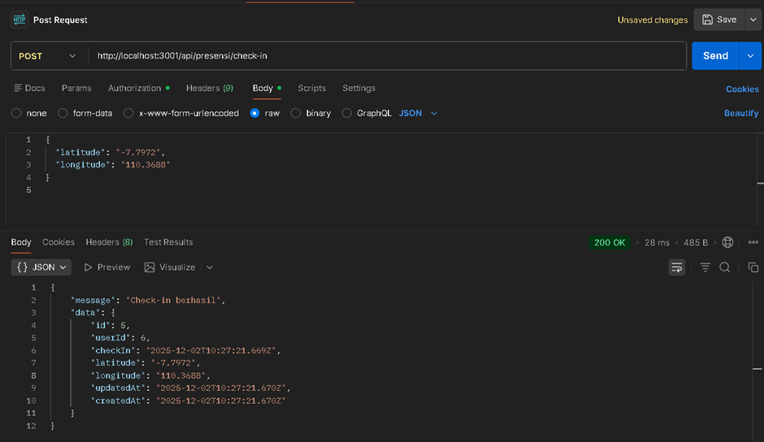
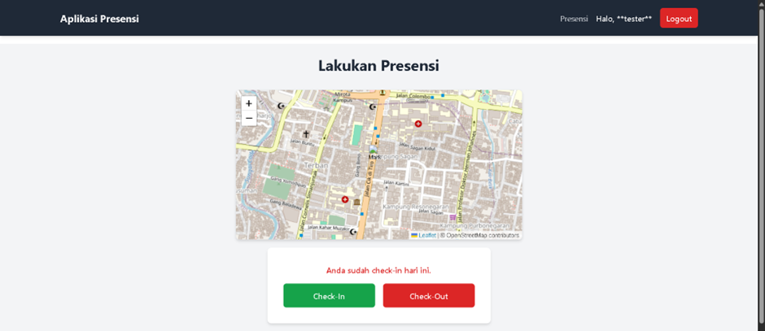
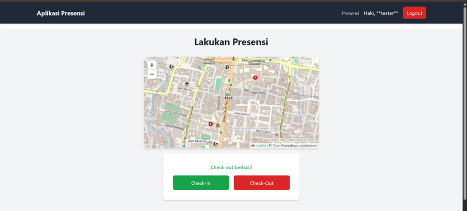
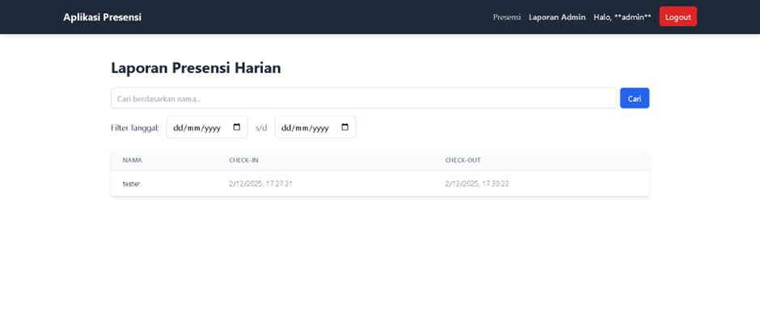
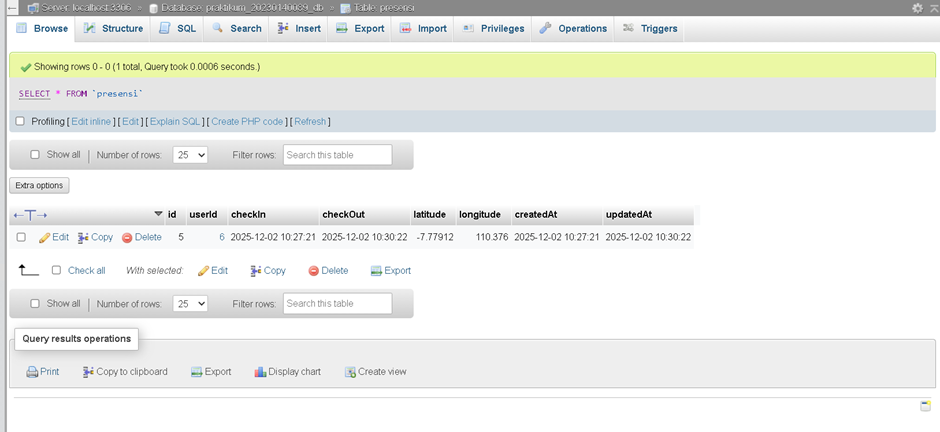

1. Endpoint presensi/check-in dengan menggunakan bearer token dan body latitude, longitude

2. Tampilan halaman presensi dengan menampilkan maps OSM
Checkin

CheckOut

3. Tampilan halaman report yg berisi data presensi dari semua user

4. Screenshote tabel presensi di database
